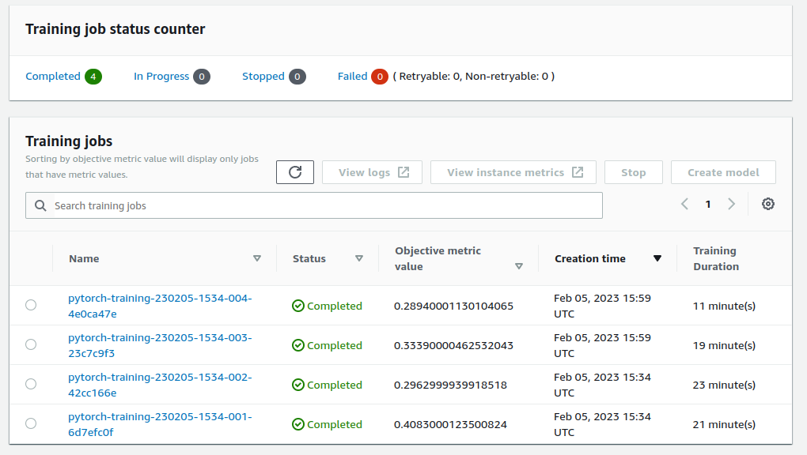

# Image Classification using AWS SageMaker

In this project, we use AWS Sagemaker to train a pretrained model that can perform image classification by using the Sagemaker profiling, debugger, hyperparameter tuning and other good ML engineering practices.

## Dataset
The provided dataset is the dog breed classification dataset which can be found in the classroom. 
It contains images from 133 dog breeds divided into training, testing and validation datasets. The dataset can be 
downloaded from [here](https://s3-us-west-1.amazonaws.com/udacity-aind/dog-project/dogImages.zip).

**Note**: The project is designed to be dataset independent so if there is a dataset that is more interesting or relevant to your work, you are welcome to use it to complete the project.

## Project Set Up and Installation

1. Open Sagemaker Studio and create a folder for your project
2. Clone the project [repo](https://github.com/udacity/CD0387-deep-learning-topics-within-computer-vision-nlp-project-starter) from the Sagemaker Studio.
3. Download the dataset from [here](https://s3-us-west-1.amazonaws.com/udacity-aind/dog-project/dogImages.zip)
4. Unzip the files(if needed)

We use [train_and_deploy.ipynb](./train_and_deploy.ipynb) which helps us interface with Sagemaker and submit training 
jobs to it.

### Access
Upload them to an S3 bucket so that Sagemaker can use them for training.

[](#)

## Hyperparameter Tuning

I chose ResNet50 for its ease of use, light weight, and computational power.

To hyperparameter tuning, I tried different values for the following hyperparameters:
- lr: ContinuousParameter(0.001, 0.1)
- batch_size: CategoricalParameter([16, 64])
- epochs: IntegerParameter(5, 10)


[](#)

And finally, the best config is:

[](#)


After hyperparamater tuning phase, the model will be trained with best hyperparameters in a training job. We can see a
part of the logs inside the job corresponding to training & testing phase of the model.

[](#)

[hpo.py](./hpo.py) script is the one which be used for setting up hyperparameter tuning process. We use 
[train_model.py](./train_model.py) for handling the training phase of our classification task.

## Debugging and Profiling

Since we have a training job with best hyperparameters, we directly debug and profile that job with the following
configuration:

```
rules = [
    Rule.sagemaker(rule_configs.vanishing_gradient()),
    Rule.sagemaker(rule_configs.overfit()),
    Rule.sagemaker(rule_configs.overtraining()),
    Rule.sagemaker(rule_configs.poor_weight_initialization()),
    ProfilerRule.sagemaker(rule_configs.ProfilerReport()),
]

profiler_config = ProfilerConfig(
    system_monitor_interval_millis=500, framework_profile_params=FrameworkProfile(num_steps=10)
)

debugger_config = DebuggerHookConfig(
    hook_parameters={"train.save_interval": "100", "eval.save_interval": "10"}
)
```

and put them in estimator instance:

[](#)


### Results

#### Debugger Line plot
[](#)
As we can see, our training job is so IO-intensive because ```GPUMemoryUtilization``` is oscillating due to memory 
allocation and release. This observation is compatible with coming results obtained from profiler.

#### Operators

For both CPU and GPU operators, the three most expensive operations were:
1. copy_
2. contiguous
3. to

which makes sense because these operations deal with memory transfers and allocations.

#### Rules

```LowGPUUtilization``` rule was the most frequently triggered one. It can happen due to bottlenecks, blocking calls
for synchronizations, or a small batch size.

Since the batch size is 16 in our experiment, it's worth to try bigger 
numbers for batch_size hyperparameter because ```BatchSize``` rule was triggered six times in the experiment.


## Model Deployment

The model deployment is implemented using a stand-alone script([inference.py](./inference.py) in our project). This
script should at least all the things for inference of the model which is ```model_fn```.

In notebook, we use the script as shown below:

[](#)

[](#)

With having ```predictor``` instance, we can invoke the endpoint by some predictions:

[](#)

As we can see, the model has a successful prediction on this sample case.

## Standout Suggestions
**TODO (Optional):** This is where you can provide information about any standout suggestions that you have attempted.
